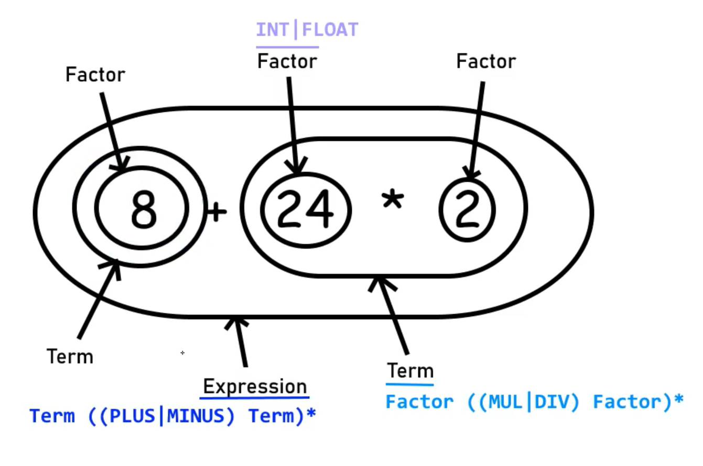

### Project Lex
=========

### Grammar Rules

#### Resolution priority hierarchy
- Factor `eg: 1, or (1 + 2), or 1 + 2`
- Term `eg: 1 * 2, of 3 * 4, or 10 % 5`
- Expression `eg: 1 + 2, or 3 + 4, or 5 + 6`

| Name                   | Description                                                                 |
|------------------------|-----------------------------------------------------------------------------|
| expression             | `term ((PLUS or MINUS) term)*`                                                   |
| term                   | `factor ((MOD or MUL or DIV) factor)*`                                      |
| factor                 | `(PLUS or MINUS) factor`                           |
|                        | `power`                           |
| power                  | `atom (RAISED TO factor)*`                             |
| atom                   | `INT or FLOAT`                                                 |
|                        | `LPAREN expression RPAREN`                                               |

`(operation)*` = repeat operation 'til there's none

#### Illustration

